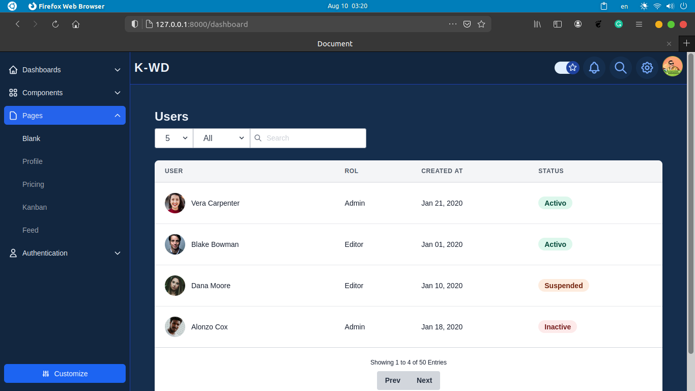
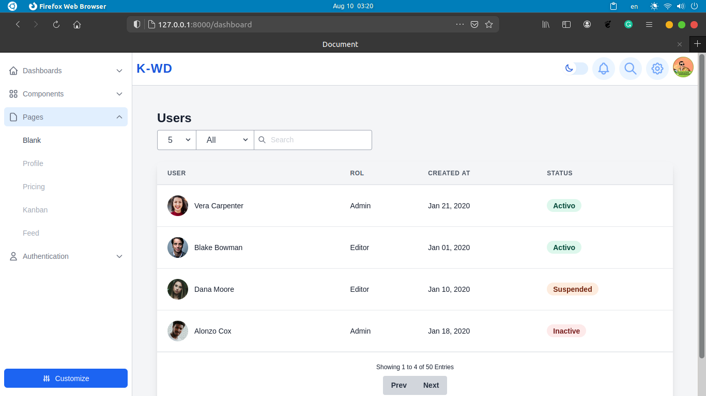
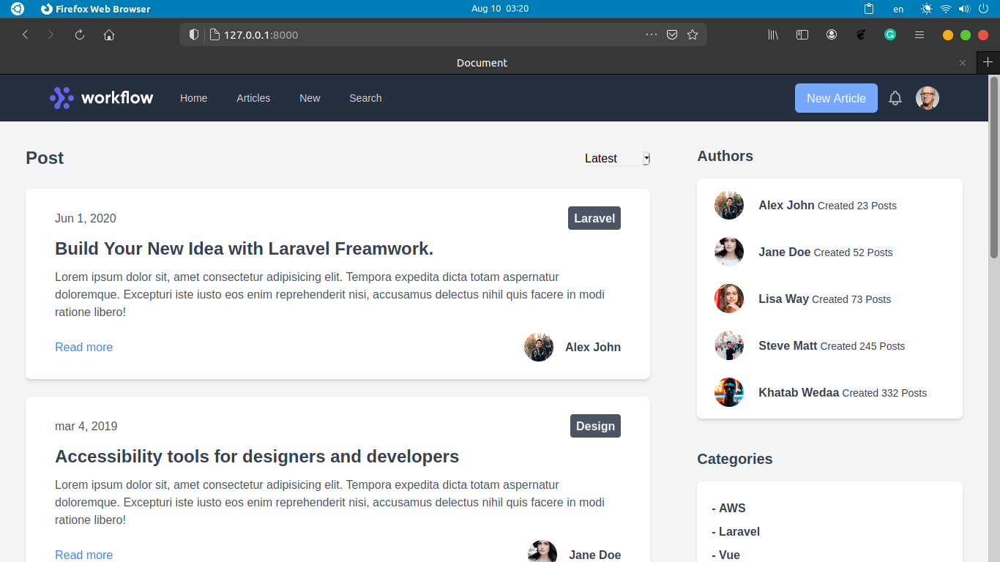
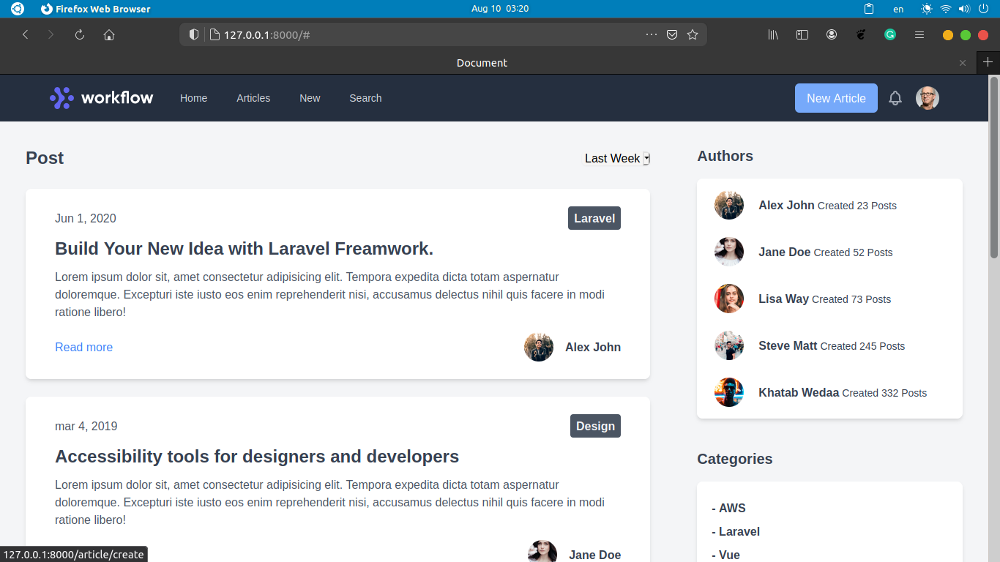
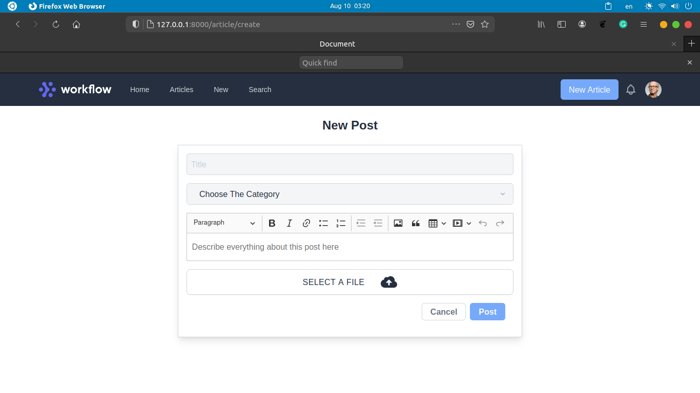
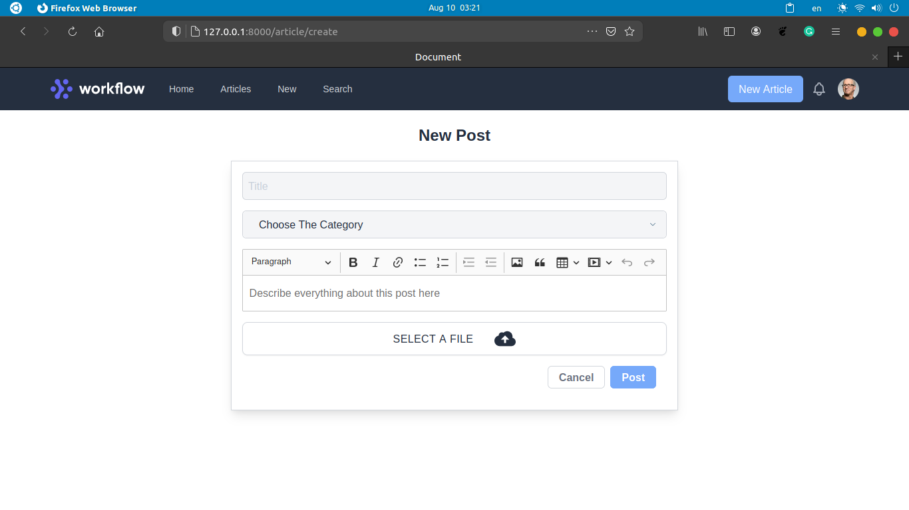
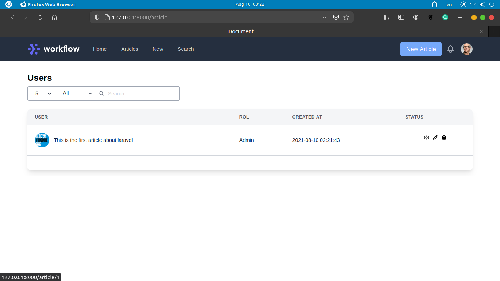
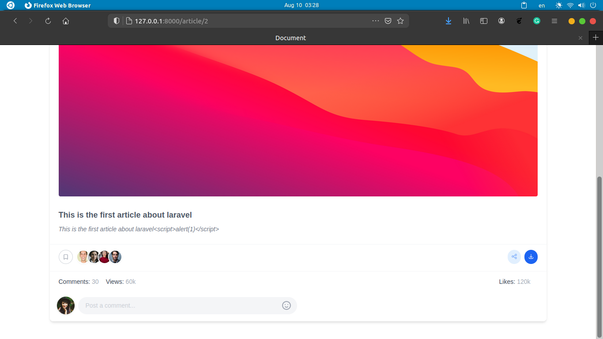
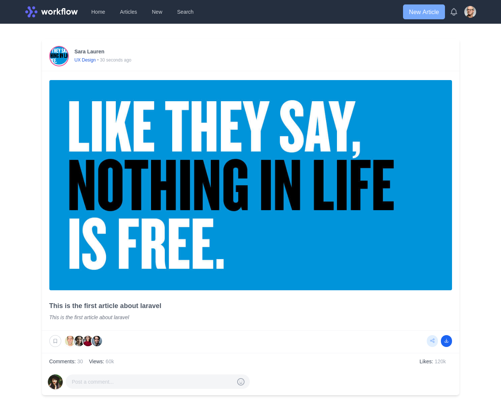
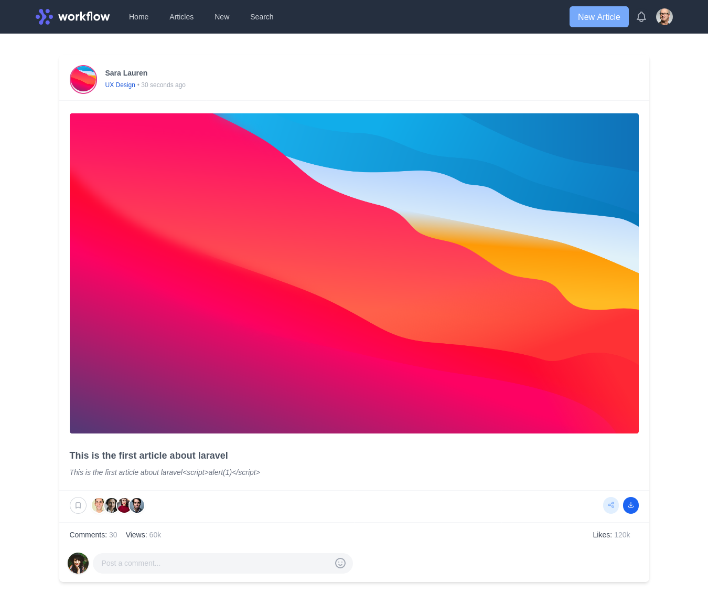

# Laraimg

## Simple laravel gallery project

### Tools 
- Laravel framawork
- Tailwindcss
- MYSQL

### Installing
1. `git clone https://github.com/ojpro/laraimg`
2. cd laraimg
3. `cp .env.example .env`
4. configure .env database connection settings
5. `php artisan megrate`
6. php artisan serve`

### Screenshots

